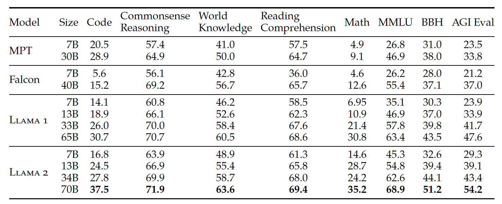

# stablefrog
 - LLM based data transformation task to enable any format or type of data to what Foundational models would need.
 - LLM evaluation framework where processing all evaluation metrics is done for you

This library helps you compute score against MMLU, BBH, simple Math dataset and identifies how your Foundational model is doing w.r.t. to other commercially available models

